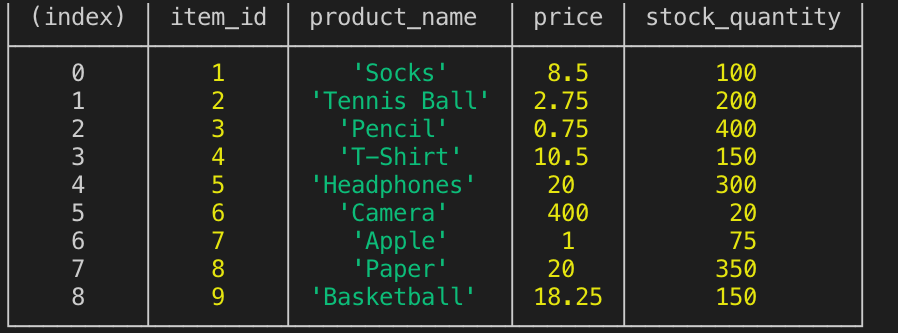
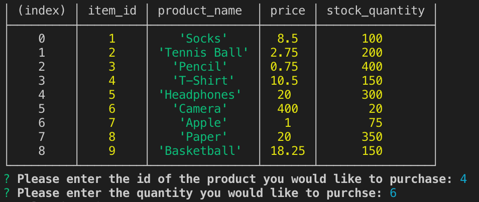
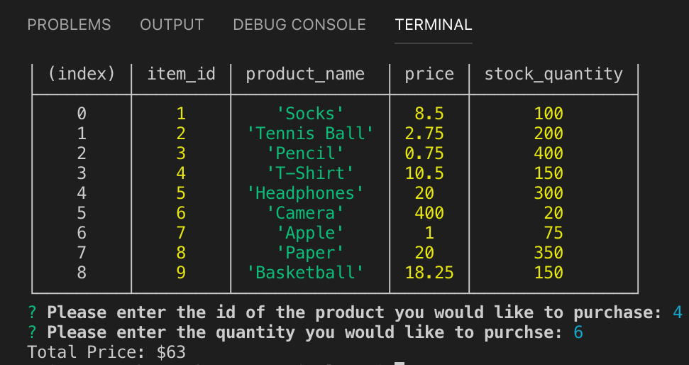
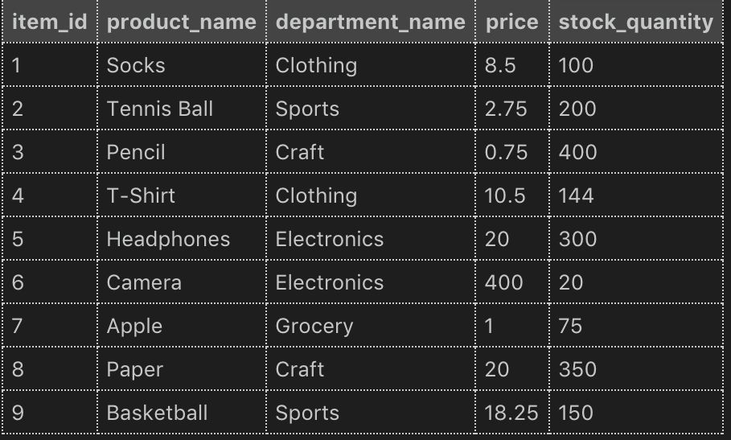

# BAMAZON

Amazon-like storefront CLI app

https://github.com/noplanetnoparty/bamazon

## Table Display
When the user runs the bamazonCustomer.js file, the products table displays: 

   * Item ID
   * Product Name
   * Price
   * Quantity

Screenshot:

## Prompt
After the table is displayed the user is prompted to enter the item id and quantity of the product they would like to purchase:

Screenshot:

## Output

After the user responds to the prompts, the total price of their purchase is displayed:

Screenshot:

## Database Update

Once the user has purchased their product, the database updates:

Screenshot:

